# UX / UI Review & Walkthrough -- ChatGPT Browser

**Date:** 2026-02-08
**Data Set:** 3,840 conversations imported from ChatGPT export
**Browser:** Chromium-based, 1200x800 viewport

---

## Application Walkthrough

### 1. Home Page -- Conversation List

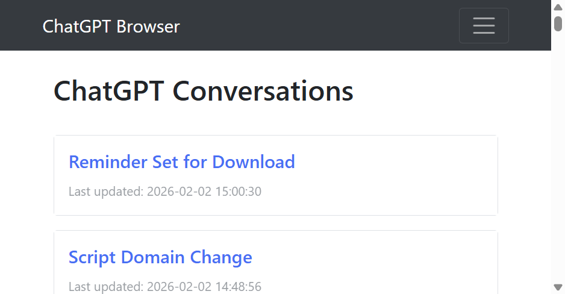

The home page displays a flat list of every conversation as a Bootstrap card. Each card shows:
- Conversation title (clickable link)
- "Last updated" timestamp

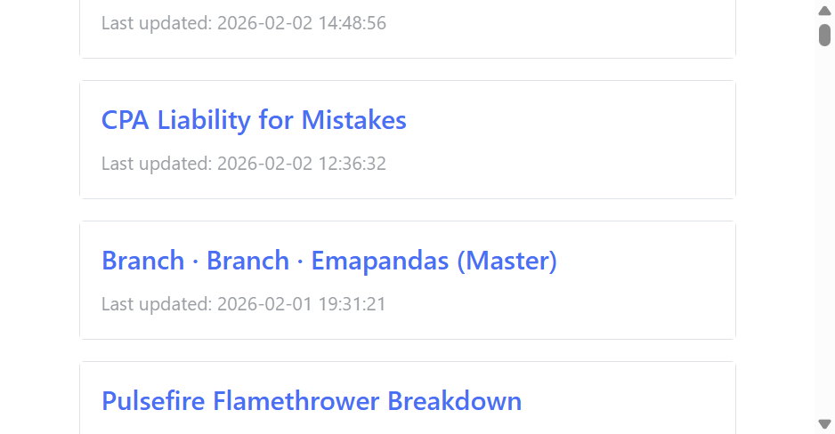

Scrolling reveals an endless wall of cards with no grouping, search, or visual hierarchy.

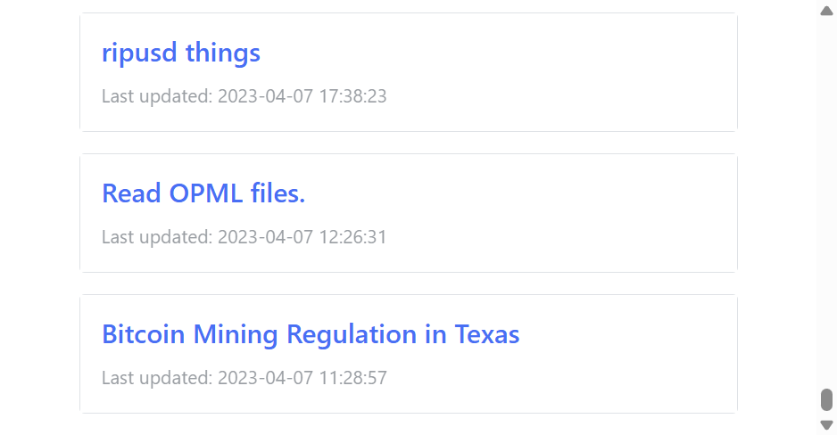

The list goes all the way to the bottom -- all 3,840 conversations are rendered in a single HTML page. There is no pagination, no infinite scroll, no search, and no filtering.

### 2. Navbar

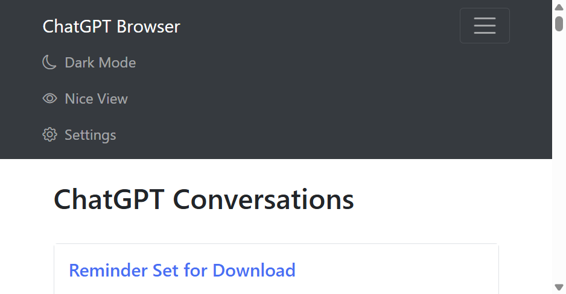

The navbar collapses into a hamburger at most viewport widths. When expanded it shows:
- **Dark Mode** toggle (a link, not a switch)
- **Nice View** indicator (not clickable -- just a label)
- **Settings** link

The view mode indicator is purely informational here -- you cannot toggle it from the navbar. This is confusing because it looks like a nav link but does nothing.

### 3. Nice Conversation View

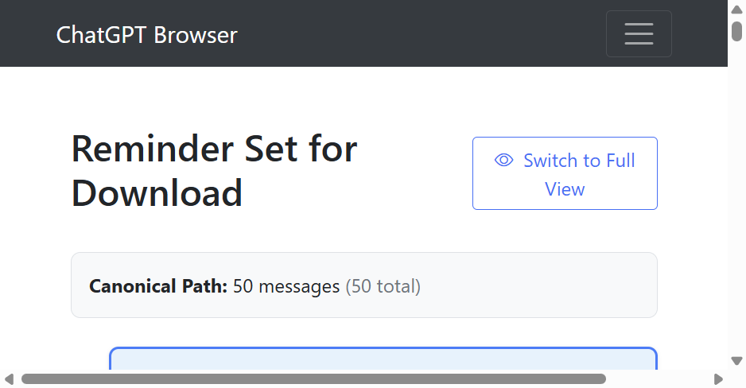

Clicking a conversation opens the "Nice" (canonical path) view. The header shows:
- Conversation title
- "Switch to Full View" button
- Canonical path message count vs total count

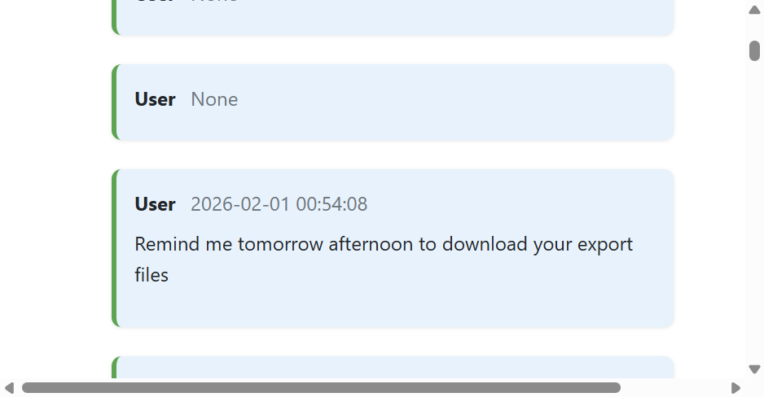

Messages are displayed as left-aligned cards with a green left border for user messages and a blue left border for assistant messages. Each shows the sender name and timestamp.

**Issue spotted:** Several messages show **"User None"** where the timestamp should be. This happens for messages with `create_time = None` -- the datetime filter returns `None` as-is and the template just prints it.

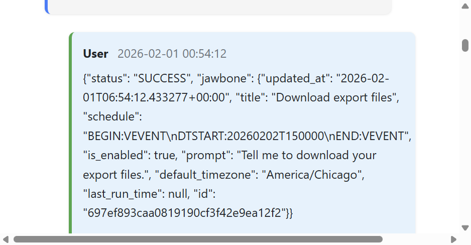

**Major issue:** Some message content contains structured data (tool calls, API responses, etc.) that is rendered as raw JSON blobs inside user message bubbles. There is no attempt to detect and format these differently.

### 4. Settings Page

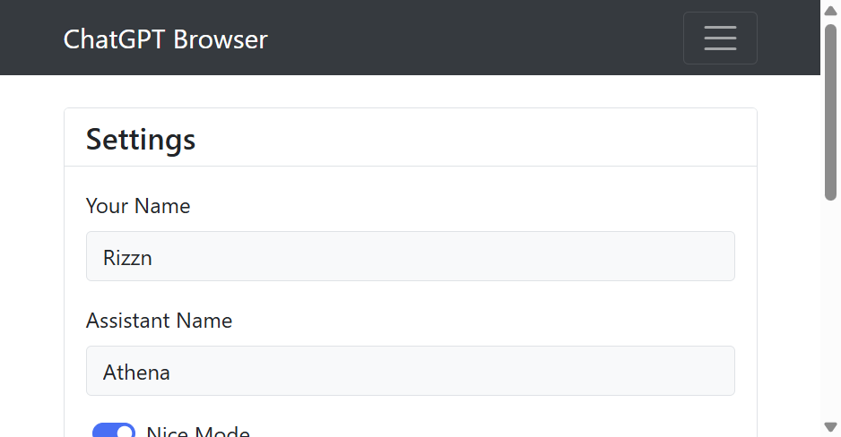

The settings page has two sections:
- **Settings card**: User name, Assistant name, Nice/Dev mode toggle, Verbose mode toggle, Save button
- **Import Conversation card**: File picker + Import button

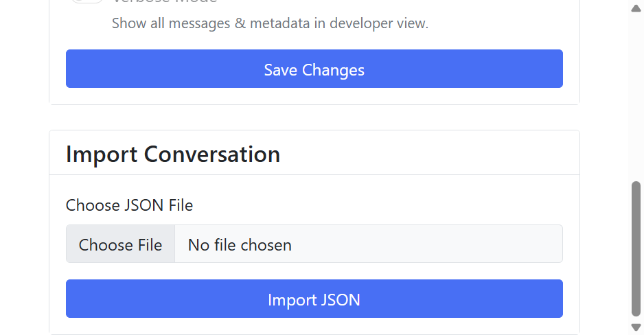

The import section shows a basic file input. There is no progress indicator, no drag-and-drop, no feedback about what file types are accepted beyond the `accept=".json"` attribute.

### 5. Dark Mode

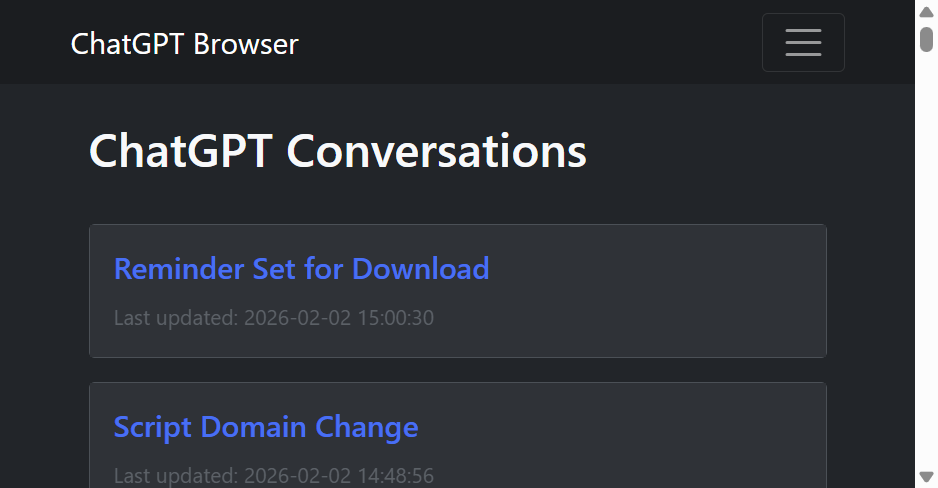

Dark mode applies a dark background to the page body and cards. The navbar already had a dark background, so it's nearly indistinguishable.

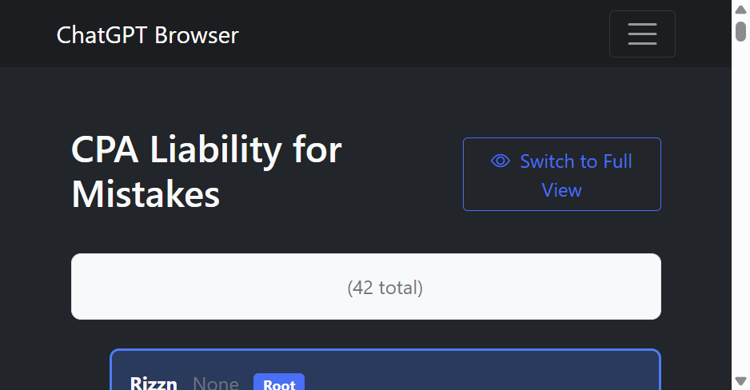

**Bug:** The "Canonical Path" info box renders with a **white background** in dark mode because its CSS uses hardcoded colors instead of CSS variables.

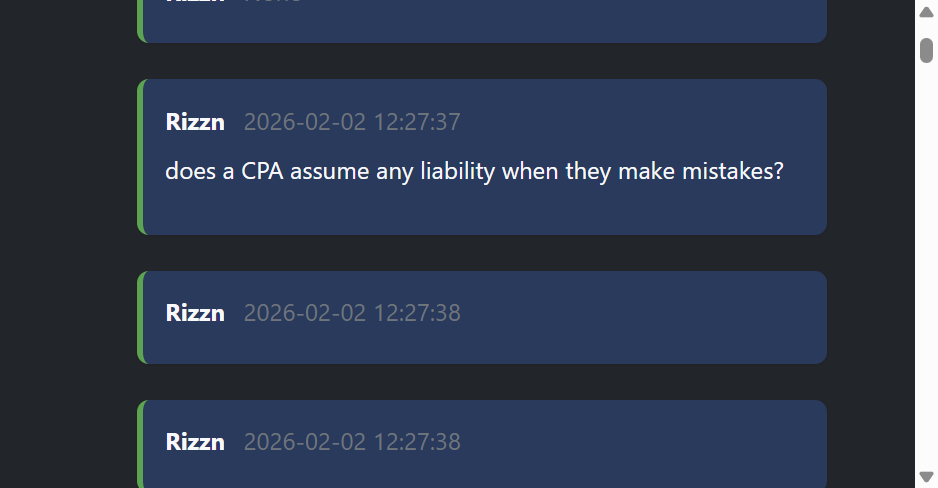

User messages in dark mode use a dark blue background that works reasonably well.

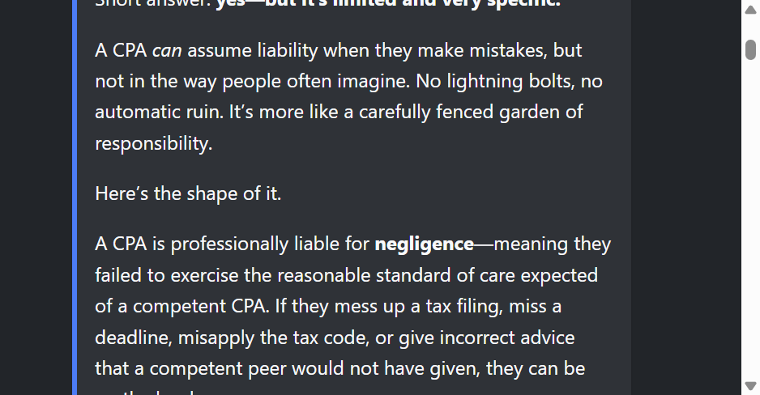

Assistant messages render with good contrast. Markdown formatting (bold, lists, paragraphs) is preserved.

### 6. Dev / Full View

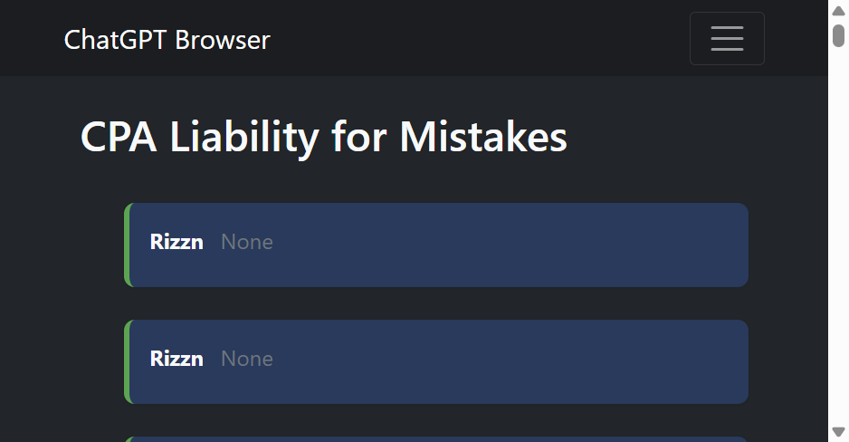

The dev/full view shows all messages in order (not just the canonical path). Without verbose mode enabled, it looks nearly identical to the nice view but includes "system" and "tool" role messages that show as empty or with "None" timestamps.

---

## Deep-Dive: Content Rendering Issues

This section documents the systemic rendering problems found by analyzing all 182,043 messages in the database and cross-referencing with how they appear in the browser. These issues affect the majority of conversations and are the primary reason the app feels broken.

### The Data: What's Actually In the Messages

The ChatGPT export format stores message content as a `parts` array where each part can be:

| Part Type | Count | Description |
|-----------|-------|-------------|
| `string` (non-empty) | 122,113 | Normal text content -- renders fine |
| `string` (empty `""`) | 27,920 | Empty strings -- render as blank bubbles |
| `dict` with `image_asset_pointer` | 3,207 | User-uploaded images or DALL-E generations |
| `dict` with `audio_transcription` / `audio_asset_pointer` | 1,490 | Voice mode conversations |
| `dict` with `video_container_asset_pointer` | 743 | Video/screen-share references |
| `None` / `null` | various | Null parts mixed with real content |

Additionally, 22,235 messages have `role = "tool"` and 18,776 have `role = "system"` -- neither of which the current app handles distinctly.

### Rendering Problem Inventory

#### R1: Image Asset Pointers Render as Giant JSON Blobs (3,207 messages)

When a user uploaded an image to ChatGPT, the export stores it as a dict like:
```json
{"content_type": "image_asset_pointer", "asset_pointer": "sediment://file_...", "size_bytes": 160224, "width": 4000, "height": 1868, "fovea": null, "metadata": {"dalle": null, ...}}
```

The app renders this as a `<pre><code>` block containing the full JSON. It dominates the screen.

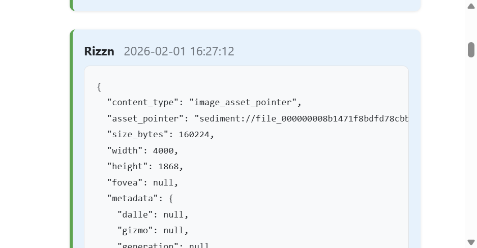

**Impact:** ~2,498 messages across the dataset show this. Any conversation where the user shared images or received DALL-E generations is full of these blobs.

**What it should do:** Show a placeholder like "[Image: 4000x1868, 160KB]" or, better, "[Image not available in export]" with the dimensions as metadata. For DALL-E images, show the generation prompt if available.

#### R2: Audio Conversations Render as Raw Dicts (1,490+ messages)

Voice-mode conversations store `audio_transcription` parts alongside `audio_asset_pointer` parts. The transcription text IS present in the data but is inside a dict:
```json
{"content_type": "audio_transcription", "text": "actual spoken words here"}
```

The app renders the entire dict as JSON instead of extracting and displaying the `text` field.

**What it should do:** Extract the `text` field from `audio_transcription` parts and render it as normal message text, optionally with a small indicator that it was a voice message.

#### R3: Tool Messages Rendered as User Messages (22,235 messages)

The template logic is:
```html
{{ assistant_name if message.role == 'assistant' else user_name }}
```

This means `tool`, `system`, and any other role all display as the user's name ("Rizzn"). Tool responses -- like reminder confirmations, web search results, code interpreter output -- appear as if the user said them.

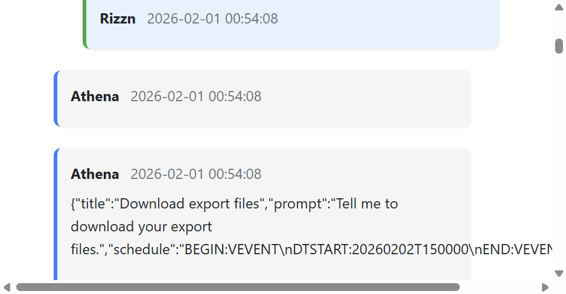
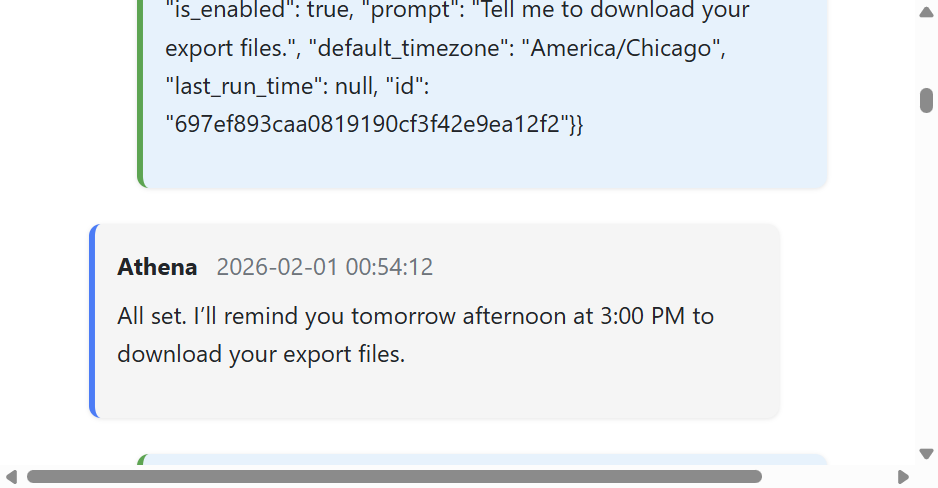

**What it should do in Nice Mode:** Tool messages should be hidden entirely OR collapsed into a small "Tool: [name]" indicator between the user message and the assistant's response. In Dev Mode, they should be shown with a distinct "Tool" role label and a different visual treatment (e.g. monospace, dimmed, collapsible).

#### R4: System Messages Leak Into Nice View (18,776 messages)

100% of system messages have empty content (`[]` or `[""]`), so they render as blank bubbles showing only "Rizzn None" (the user name + null timestamp). The Nice Mode template filters out messages where `content|fromjson` is empty, but the "empty check" only catches `[]` -- it doesn't catch `[""]` (a list with one empty string).

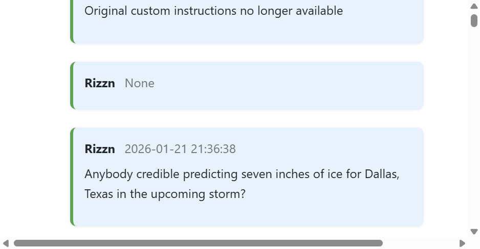

Messages like "Original custom instructions no longer available" also leak through as user messages.

**What it should do in Nice Mode:** System messages should NEVER appear. In Dev Mode, they should be shown with a distinct "System" label and collapsed by default.

#### R5: Empty Message Bubbles Everywhere

Across the dataset:
- 18,776 system messages: 100% have empty content
- 22,235 tool messages: 70.4% have empty content (15,657)
- 82,444 assistant messages: 26.4% have empty content (21,760)
- 58,588 user messages: 4.2% have empty content (2,454)

**Every single conversation** in the top 50 has empty nodes in its canonical path (50 out of 50 checked). These show up as blank bubbles with just "Rizzn None" or "Athena None".

**What it should do:** Empty messages should be completely suppressed in Nice Mode. The current filter catches some but not all because the condition `` passes for `[""]` (length 1, but the only element is an empty string).

#### R6: Canonical Path Label Is Confusing for Branched Conversations (cosmetic -- NOT a logic bug)

ChatGPT "branches" create new conversation records that share parent messages with the original conversation. The canonical path walker correctly follows `parent_id` across conversation boundaries to include the inherited context -- **this is correct behavior** and faithfully reconstructs the full conversation as the user experienced it. Verified: parent messages form a clean contiguous block at the root side of the path, current conversation messages at the leaf side.

However, the info box label creates confusion:

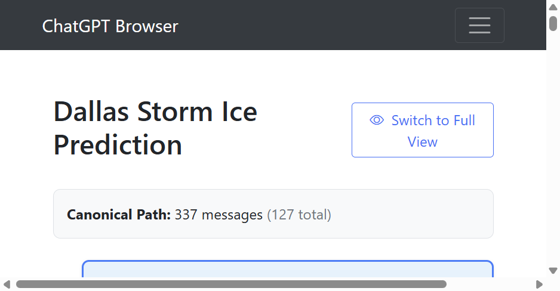

"Canonical Path: 337 messages (127 total)" -- 337 is the full thread including inherited parent context (correct); 127 is only the messages that belong directly to this conversation record in the DB. For branched conversations, path > total, which looks paradoxical to the user.

**Proposal:** Improve the label, e.g. "337 messages in thread" (drop the total), or "337 messages in thread (127 in this branch, 210 inherited)". **The underlying path logic must NOT be changed -- it is working correctly.**

#### R7: Web Search / Citation References Render as Garbage

When ChatGPT uses web search, the assistant's response contains inline references like `turn0news1`, `turn0news7` etc. These render as raw text mixed with broken unicode glyphs:

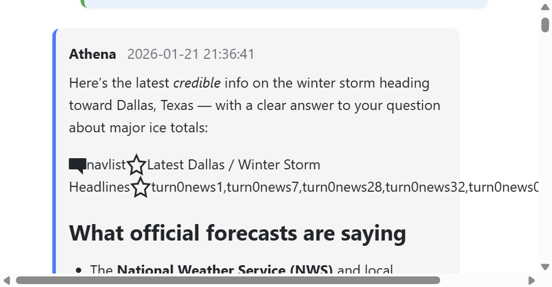

The `navlist` search reference structure renders inline with star-emoji placeholders.

**What it should do:** Parse search result references and either render them as footnote-style links, or strip them entirely in Nice Mode and show them only in Dev Mode.

#### R8: Multipart Messages (Text + Images) Render Poorly

Messages where the user sent text AND images together (e.g. "Check it out" + 2 images) render the text normally but dump the image dicts as JSON blobs. There's no visual separation between the text part and the image placeholder parts.

**What it should do:** Render text parts as text, and image/audio/video parts as distinct placeholders below the text, with clear visual separation.

#### R9: Empty String Parts Create Visual Gaps

27,920 content parts are empty strings. When a message has `["", "actual text"]`, the empty string part renders as nothing but still takes up space in the DOM, creating odd whitespace gaps.

---

### Summary: The Content Rendering Fix Is The Biggest Single Improvement

Fixing content rendering requires:

1. **A content-type-aware renderer** that dispatches on part type:
   - `string` -> markdown render (existing)
   - `dict` with `content_type == "image_asset_pointer"` -> image placeholder
   - `dict` with `content_type == "audio_transcription"` -> extract `.text`, render as message
   - `dict` with `content_type == "audio_asset_pointer"` -> audio placeholder or hide
   - `dict` with `content_type == "real_time_user_audio_video_asset_pointer"` -> video placeholder or hide
   - anything else -> collapsible JSON in Dev Mode, hidden in Nice Mode

2. **Role-aware display logic**:
   - `user` -> show with user styling
   - `assistant` -> show with assistant styling
   - `tool` -> hide in Nice Mode; show as collapsible "Tool Output" in Dev Mode
   - `system` -> hide in Nice Mode; show as "System" in Dev Mode

3. **Empty content suppression** that actually works (check each part, not just array length)

4. **Info box label fix** for branched conversations (the path logic itself is correct and must not be changed)

This is a significant engineering effort because it requires:
- Deep analysis of all `content_type` values in the export format (done above)
- Template logic rewrite for both nice and dev modes
- Possibly a pre-processing step at import time to extract/normalize content
- Testing against the full 3,840 conversation dataset to catch edge cases

---

## UX / UI Issues & Improvement Proposals

### Critical Issues

#### P0: No Search or Filtering
With 3,840 conversations, finding anything requires scrolling through thousands of cards or using Ctrl+F in the browser. This is the single biggest usability problem.

**Proposal:**
- Add a search bar at the top of the home page with instant client-side filtering (for smaller datasets) and server-side search (for scale).
- Add filters: by date range, by keyword, by model used.
- Consider full-text search with SQLite FTS5.

#### P0: No Pagination
All conversations are rendered in a single page. This causes:
- Multi-second initial page loads
- Massive DOM (11,520+ nodes in the snapshot)
- Browser memory bloat
- Unusable scrollbar (tiny thumb)

**Proposal:**
- Server-side pagination: 50 conversations per page with prev/next controls.
- Or: infinite scroll with intersection observer, loading 50 at a time.
- Show total count and current page position.

#### P1: Raw JSON Blobs in Messages
Tool call results, image references, and structured content render as raw JSON strings. This is unreadable.

**Proposal:**
- Detect content parts that are dicts/objects and render them in a collapsible `<details>` block with syntax-highlighted JSON.
- For known types (tool calls, image references), render purpose-built UI cards.
- At minimum, wrap non-string parts in a styled `<pre>` block rather than inline text.

#### P1: "None" Timestamps Everywhere
Messages without timestamps display the literal text "None".

**Proposal:**
- If `create_time` is `None`/null, hide the timestamp entirely or show "Unknown date".
- Same for the conversation list's "Last updated" -- some entries show malformed timestamps.

---

### Navigation & Information Architecture

#### P1: No Breadcrumbs or Back Button
Once inside a conversation, the only way back is clicking "ChatGPT Browser" in the nav brand. There is no visual cue that this is a back link.

**Proposal:**
- Add a "Back to Conversations" link/button at the top of every conversation view.
- Add breadcrumbs: Home > Conversation Title.

#### P1: Navbar View Mode Indicator Is Confusing
The navbar shows "Nice View" or "Dev View" as a `<span>` that looks like a link but isn't clickable. Users will try to click it.

**Proposal:**
- Either make it a working toggle button, or remove it from the navbar and rely on the Settings page.
- If kept, style it distinctly as a badge/pill, not as a nav link.

#### P2: Settings UX Is Disconnected
Toggling view mode and verbose mode on the settings page fires async `fetch()` calls but gives no visual feedback. The save button only saves the name fields (not the toggles, which save via JS immediately). This is confusing.

**Proposal:**
- Unify the save mechanism: either save everything on button click, or save everything immediately on change.
- Show toast notifications for successful saves.
- Group related settings visually.

#### P2: Dark Mode Toggle Is a Full Page Reload
Clicking "Dark Mode" in the navbar navigates to `/toggle_dark_mode` which does a 302 redirect to the referrer. This causes a full page reload and scroll position loss.

**Proposal:**
- Toggle dark mode via JS + fetch, then swap the CSS class on `<body>` without reloading.
- Persist the preference to the server in the background.

---

### Visual Design

#### P1: Zero Visual Hierarchy on Home Page
Every conversation card looks identical. There's no way to distinguish recent from old, long from short, or conversations by topic.

**Proposal:**
- Show message count per conversation.
- Show the model(s) used (GPT-4, etc.) as small badges.
- Add relative timestamps ("2 hours ago" vs "2023-04-07 11:28:57").
- Consider grouping by date (Today, Yesterday, This Week, This Month, Older).
- Truncated preview of the first message.

#### P2: Message Bubbles Lack Visual Distinction
User and assistant messages differ only by a thin 4px colored left border. At a glance, the conversation is a wall of same-looking cards.

**Proposal:**
- Use distinct background colors for user vs assistant (the CSS variables exist but are barely perceptible).
- Align user messages right and assistant messages left (chat-style layout).
- Add avatars or role icons (user icon, bot icon).
- Increase spacing and add clearer role labels.

#### P2: No Syntax Highlighting for Code Blocks
Markdown code blocks render as plain `<pre><code>` with no syntax highlighting. For a developer tool, this is a major gap.

**Proposal:**
- Add highlight.js or Prism.js with auto-language detection.
- Add a "Copy" button to code blocks.

#### P3: Typography and Spacing
- Message text uses the browser default serif/sans stack with no typographic refinement.
- Line height and paragraph spacing are adequate but could be tighter for dense conversations.
- The conversation title `<h1>` is oversized relative to the content.

**Proposal:**
- Set an explicit font stack (Inter, system-ui, etc.).
- Reduce title size. Use `h2` or styled `h1` at ~1.5rem.
- Tighten vertical rhythm in message content.

---

### Functionality Gaps

#### P1: No Conversation Deletion
There is no way to delete a conversation. Once imported, data stays forever.

**Proposal:**
- Add a delete button per conversation (with confirmation modal).
- Add a "Delete All" in settings for fresh starts.
- Consider soft-delete with an "archive" state.

#### P1: No Export / Download
You can import data but you cannot export it. There's no way to get data out of the app.

**Proposal:**
- Add export as JSON (re-create the ChatGPT format).
- Add export as Markdown (useful for sharing individual conversations).
- Add export as PDF (for archival).

#### P2: No Conversation Statistics / Dashboard
With 3,840 conversations, there's no summary view -- how many messages total, most active periods, models used, etc.

**Proposal:**
- Add a dashboard/stats page: total conversations, total messages, conversations over time chart, most-used models, average conversation length.

#### P2: Web Import Is Broken
The file upload field name mismatch (`json_file` in HTML vs `file` in Python) means the web import silently fails. Even if fixed, there is:
- No progress bar for large files
- No streaming -- the entire file is read into memory
- No validation feedback

**Proposal:**
- Fix the field name bug.
- Add a progress bar (use chunked upload or at least a spinner).
- Add client-side file size validation.
- Show import results: N conversations added, N updated, N errors.

#### P3: No Keyboard Shortcuts
No keyboard navigation for power users (j/k to move between conversations, / to search, etc.).

#### P3: No Conversation Bookmarks / Favorites
No way to pin or favorite important conversations for quick access.

---

### Responsive & Accessibility

#### P2: Navbar Never Expands
The Bootstrap `navbar-expand-lg` breakpoint is 992px, but the navbar stays collapsed even at 1200px viewport width in the browser tool. The nav items are hidden behind a hamburger at all times for many users.

**Proposal:**
- Test and fix the responsive breakpoint.
- Consider a persistent sidebar for the nav on desktop.

#### P3: No ARIA Labels on Interactive Elements
Toggle buttons, the hamburger menu, and dynamic content lack proper ARIA labels and roles.

#### P3: No Skip-to-Content Link
Screen reader users must tab through the entire navbar on every page.

---

## Proposed Redesign Priorities

| Priority | Item | Impact | Effort |
|----------|------|--------|--------|
| P0 | Search / filter on home page | Transformative | Medium |
| P0 | Pagination | Critical perf fix | Small |
| P1 | Fix "None" timestamps | Visual polish | Trivial |
| P1 | Fix raw JSON blobs in messages | Readability | Medium |
| P1 | Breadcrumbs / back button | Navigation | Trivial |
| P1 | Conversation deletion | Data management | Small |
| P1 | Fix web import (field name bug + UX) | Core feature broken | Small |
| P1 | Visual hierarchy on home page | Usability | Medium |
| P2 | Chat-style message layout | Visual appeal | Medium |
| P2 | Syntax highlighting for code | Developer UX | Small |
| P2 | Dark mode JS toggle (no reload) | Polish | Small |
| P2 | Export functionality | Feature gap | Medium |
| P2 | Stats dashboard | Insight | Medium |
| P2 | Settings UX unification | Consistency | Small |
| P3 | Keyboard shortcuts | Power users | Medium |
| P3 | Accessibility improvements | Compliance | Medium |
| P3 | Typography refinement | Polish | Trivial |

---

## Screenshots Reference

All screenshots are stored in `docs/screenshots/` and referenced above:

| File | Description |
|------|-------------|
| `01_home_page.png` | Home page, light mode, top |
| `02_home_scrolled.png` | Home page scrolled |
| `03_home_bottom.png` | Home page bottom (last conversations) |
| `04_nice_conversation.png` | Nice view header |
| `05_nice_conversation_messages.png` | Nice view messages with "None" timestamps |
| `06_nice_conversation_assistant_msg.png` | Raw JSON blob in message |
| `07_settings_page.png` | Settings page top |
| `08_settings_page_bottom.png` | Settings page import section |
| `09_dark_mode_home.png` | Dark mode home page |
| `10_dark_mode_conversation.png` | Dark mode conversation (white info box bug) |
| `11_dark_mode_conversation_scrolled.png` | Dark mode user messages |
| `12_dark_mode_assistant_response.png` | Dark mode assistant response |
| `13_dev_view_dark.png` | Dev/full view in dark mode |
| `14_wide_home_light.png` | Wide viewport home page |
| `15_hamburger_expanded.png` | Navbar hamburger expanded |
| `16_image_pointer_raw.png` | Conversation with image pointers (header) |
| `17_image_blob_in_message.png` | Image asset pointer rendered as raw JSON blob |
| `18_image_blob_continued.png` | image_group search metadata as inline garbage text |
| `19_audio_conversation.png` | Audio conversation with path > total bug visible |
| `20_audio_transcript_rendering.png` | System message leaking + empty "None" bubbles |
| `21_audio_dict_rendering.png` | navlist/search references as garbage inline text |
| `22_tool_msg_as_user.png` | Tool message displayed as user with empty bubbles |
| `23_tool_json_blob.png` | Tool JSON response rendered as user message |
